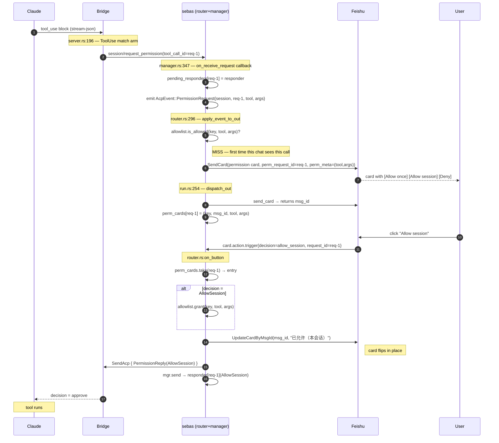
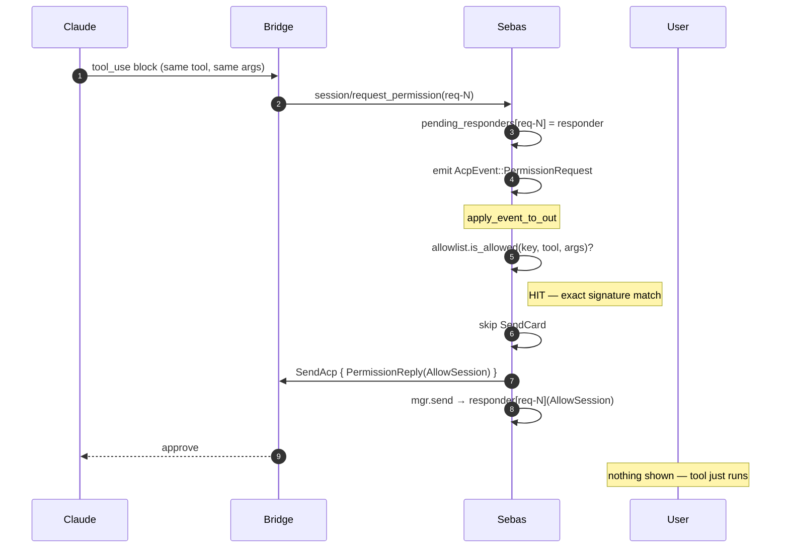
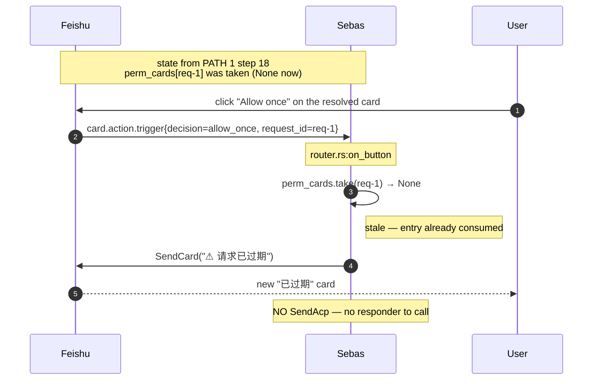
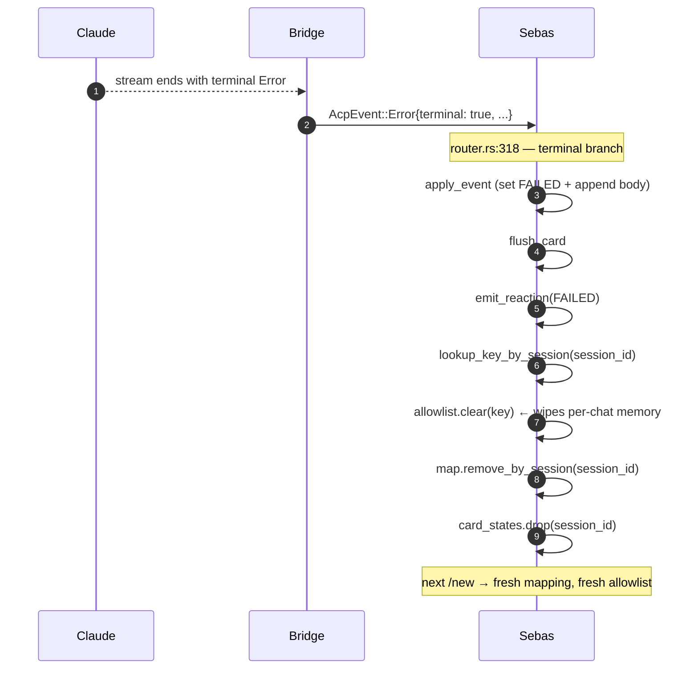

# Permission flow — sequence diagrams

The full permission round-trip from Claude's tool_use to Feishu's card flip.

**Participants**
- **Claude** — `claude --print --verbose` (spawned by bridge)
- **Bridge** — `acp-claude-bridge` (spawned by sebas, speaks ACP over stdio)
- **Sebas** — daemon: router + acp-claude manager + Feishu client
- **Feishu** — chat platform
- **Hook** — Claude's `PreToolUse` hook (sockets to bridge)
- **User** — human at Feishu

---

## 1. First-time prompt (allowlist miss → card → click)

The common case: the (tool, args) signature is NOT on the per-chat
allowlist, so the user must click.

---

## 2. Auto-approve (allowlist hit)

The (tool, args) was previously granted with "Allow session" in this
chat. The bridge sees the same approve decision, but the user sees
nothing — no card, no click needed.

---

## 3. Stale click (user clicks an already-resolved card)

The card stayed in Feishu after the first click. A follow-up click
hits the "no live perm card" path and shows a "已过期" card so the
user knows the click had no effect.

---

## 4. Session end (allowlist cleared)

When a Claude session terminates (terminal error, `/new`, daemon
restart) the per-chat allowlist is wiped so a new session starts
fresh.

---

## Key invariants

- **One responder per request_id.** The bridge holds the lock; the
  router only sends a `PermissionReply` when the user actually clicks.
  Auto-approve sends the same kind of `PermissionReply` from the router
  directly — the bridge can't tell them apart.
- **`take_perm_card` removes the entry on click.** A duplicate click
  sees `None` → "已过期" card, no double reply.
- **Allowlist scope = per `SessionKey`** (chat_id, thread_id). Cleared
  on session end. New `/new` → empty allowlist.
- **Signature is exact match** (`{tool}|{args_json}`). Slightly
  different args → fresh prompt, not auto-approved.
