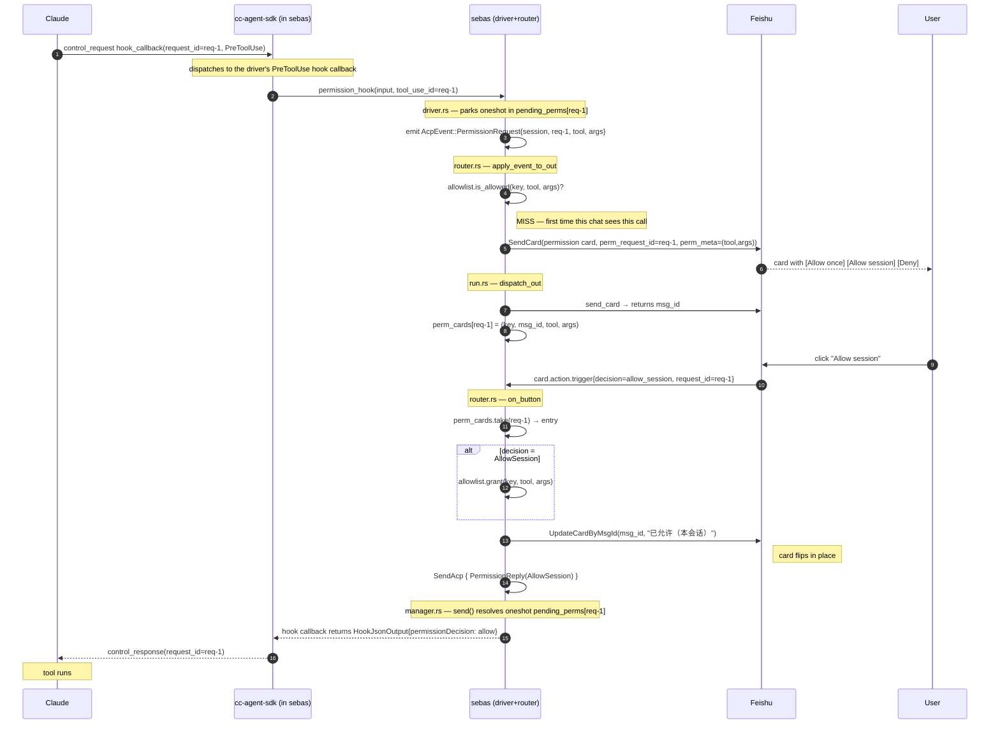
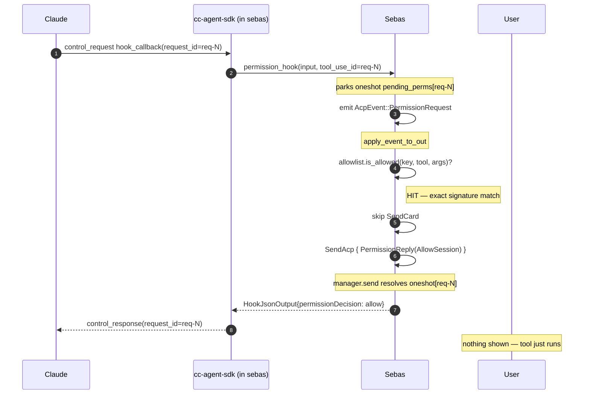
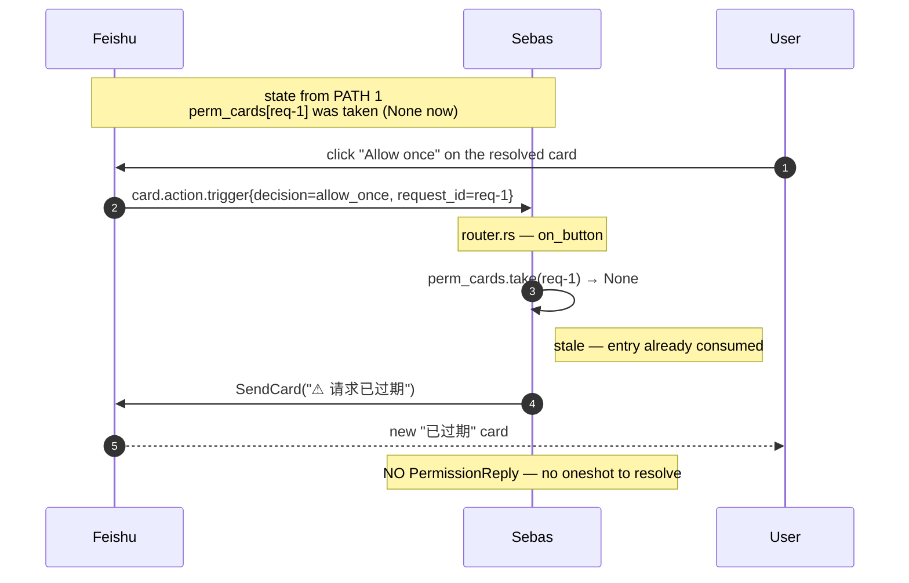
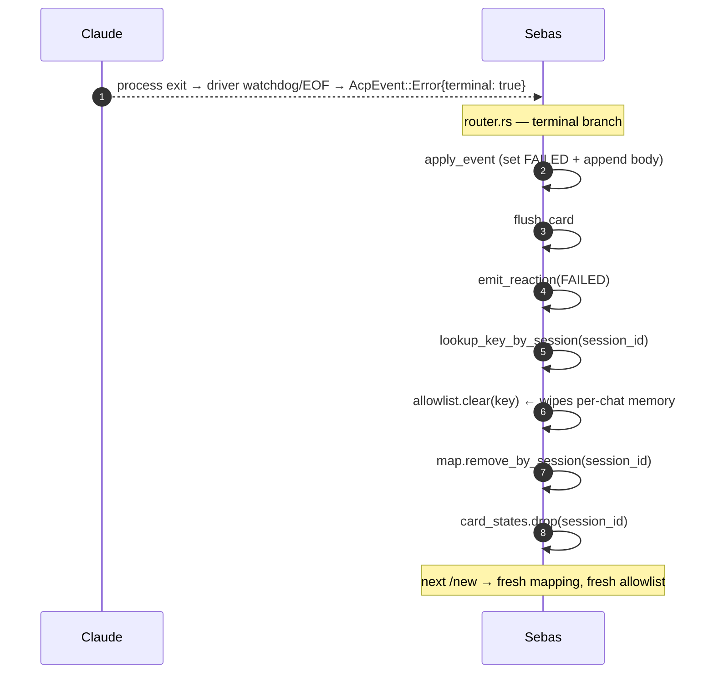

# Permission flow — sequence diagrams

The full permission round-trip from claude's tool_use to Feishu's card flip.

> Post-ACP architecture (sebas-dk8): sebas drives `claude` directly via
> `cc-agent-sdk` (stream-json + control protocol over stdio). The bridge
> process, the PreToolUse hook script and the unix-socket broker are gone —
> the permission gate is a process-internal hook callback correlated by
> control `request_id`. Design: `docs/superpowers/specs/2026-08-06-claude-direct-sdk-refactor-design.md` §4.2.

**Participants**
- **Claude** — `claude` CLI child (stream-json + control protocol on stdio)
- **SDK** — `cc-agent-sdk` `ClaudeClient` inside sebas (owns the child)
- **Sebas** — daemon: acp-claude driver/manager + router + Feishu client
- **Feishu** — chat platform
- **User** — human at Feishu

---

## 1. First-time prompt (allowlist miss → card → click)

The common case: the (tool, args) signature is NOT on the per-chat
allowlist, so the user must click.

The callback blocks on the oneshot the whole time — correlation is by
`request_id` (the claude `tool_use_id`), never by position. Parallel tool
calls each get their own request id and their own parked oneshot.

---

## 2. Auto-approve (allowlist hit)

The (tool, args) was previously granted with "Allow session" in this
chat. The hook callback still runs, but the user sees nothing — no card,
no click needed.

---

## 3. Stale click (user clicks an already-resolved card)

The card stayed in Feishu after the first click. A follow-up click
hits the "no live perm card" path and shows a "已过期" card so the
user knows the click had no effect.

If a stale/unknown `request_id` ever reaches `manager.send` directly, the
send is logged and dropped (`no pending responder`) — fail closed: the
hook callback's dropped-oneshot path answers `deny`.

---

## 4. Session end (allowlist cleared)

When a claude session terminates (terminal error, `/new`, daemon
restart) the per-chat allowlist is wiped so a new session starts
fresh.

---

## Key invariants

- **One oneshot per request_id.** The driver's hook callback parks the
  decision oneshot in `pending_perms`; the router only sends a
  `PermissionReply` when the user actually clicks (or auto-approves).
  `oneshot::Sender` gives exact FnOnce semantics — a request can be
  answered at most once.
- **Correlation is explicit, never positional.** The hook callback's
  control `request_id` (= claude's `tool_use_id`) keys the oneshot map;
  parallel tool calls cannot mispair (the ACP-era broker FIFO hazard is
  gone with the broker).
- **Fail closed.** If the router is gone or nobody answers, the oneshot
  resolves to `deny`; an unanswered callback never auto-allows.
- **`take_perm_card` removes the entry on click.** A duplicate click
  sees `None` → "已过期" card, no double reply.
- **Allowlist scope = per `SessionKey`** (chat_id, thread_id). Cleared
  on session end. New `/new` → empty allowlist.
- **Signature is exact match** (`{tool}|{args_json}`). Slightly
  different args → fresh prompt, not auto-approved.
