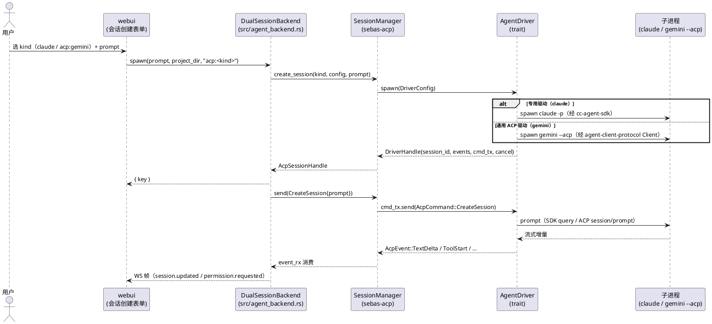
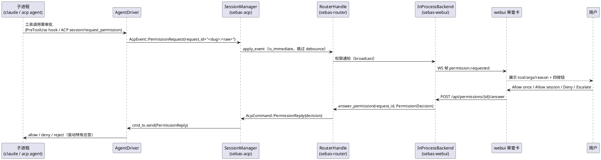
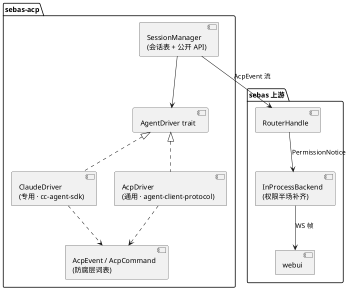

## Context

`sebas-acp` 今天只封装了 Claude Code 一种三方 agent：`sebas-acp/src/lib.rs` 是 `pub mod claude;`，协议层集中在 `claude/driver.rs`（1108 行，其中 `map_message` 165 行是纯帧翻译，其余混了握手/主循环/健康探测/权限桥），子进程由第三方 crate `cc-agent-sdk 0.1.7` 独占。配置 `AcpConfig::claude: AcpClaudeConfig` 单字段；webui 会话创建下拉只有一个 `acp · Claude Code bridge` 档位。

需求（见 proposal）：让 sebas 能驱动多种三方 coding agent，且**逐个添加新 agent 时改动最小**。调研确认两条事实线（见 `docs/superpowers/specs/` 相关调研笔记，本 change 归档时并入设计附录）：

1. **ACP（Agent Client Protocol）已是独立标准**（2025-10 迁出 Zed，成立 `agentclientprotocol` org，v1 stable）。ACP Registry 现有 39 个 agent，其中 **Gemini CLI、GitHub Copilot、Cursor、OpenCode、goose、Qwen Code、Kimi CLI、Cline 等 30+ 个原生 ACP**。Rust crate `agent-client-protocol` 2.0.0（stable-v1 入口 `Client.builder()`）累计下载 411 万。
2. **Claude Code 与 Codex 是仅有的两个例外**——两者都无原生 ACP，各靠一个 ACP org 维护的 adapter 桥接（`claude-agent-acp` / `codex-acp`）。产品上判定两者为 T0 级 agent，值得 sebas 各自维护一套专用驱动，换取协议深度能力（Claude 的 `UsageUpdate` 携带 `cache_read_input_tokens` 等 Anthropic 专有计数，通用 ACP 词表不含此项）。

结论：**混合架构**——通用 ACP 驱动覆盖长尾（新 agent ≈ 改配置），Claude 保留专用驱动（`cc-agent-sdk` 继续用），两者都收敛到同一 `AcpEvent`/`AcpCommand` 词表作为防腐层，下游 router/飞书/webui 无感。

## Goals / Non-Goals

**Goals**

- 在 `sebas-acp` 内引入一层 `AgentDriver` 抽象，让下游 `SessionManager`/`session_boot`/router 不感知"这是 Claude 专用驱动还是通用 ACP 驱动"。
- 通用 ACP 驱动：spawn 一个原生 ACP agent（`gemini --acp` 等），用 `agent-client-protocol` crate 的 `Client` 说话，把 ACP 的 `session/update` 变体翻译成 `AcpEvent`。
- Claude 专用驱动：保留现有 `driver.rs` 语义，仅把它的公共接口规整到 `AgentDriver` trait；`cc-agent-sdk` 依赖暂保留。
- 配置 schema：`AcpConfig.claude` → `AcpConfig.agents.<kind>`（向后兼容迁移），新增 `kind: "claude" | "acp:<slug>"` 语义；`default` 键。
- 补上 `InProcessBackend` 的权限半场（`permission_requests()` / `answer_permission()`），让 Claude 会话的权限请求也能进 webui 审查卡——这是调研挖出的既有抽象缺口，非本 change 新加需求，但多 agent 化会让它立刻成为多 kind 都踩的坑。
- `sebas agent-kinds list` 子命令：报告每个已配置 kind 的可达性与失败原因。

**Non-Goals**

- 不引入 `codex-acp` / `claude-agent-acp` 作为 sebas 的驱动路径——Claude 走专用驱动，Codex 的 ACP 接入通过"通用 ACP 驱动 spawn `codex-acp`"覆盖（记为 kind `acp:codex`），不在本 change 单独写 Codex 专用驱动。
- 不实现 native 内核与三方 agent 的协议转换。
- 不动 `sebas-agent`（native 内核）Phase 3 路线图。
- 不在 webui 加"会话内切换 kind"UI；kind 绑死在会话创建时。

## Decisions

### D1 — 混合驱动层：`AgentDriver` trait + 两种实现（Claude 专用 / 通用 ACP）

```rust
// sebas-acp/src/agent_driver.rs（新）
#[async_trait]
pub trait AgentDriver: Send + Sync {
    /// spawn 子进程并建立会话，返回一个可流式消费事件的句柄。
    async fn spawn(&self, cfg: &DriverConfig) -> Result<DriverHandle, DriverError>;
}

pub struct DriverHandle {
    pub session_id: String,
    pub events: tokio::sync::mpsc::Receiver<AcpEvent>, // 与现有 event_rx 同形
    pub cmd_tx: tokio::sync::mpsc::Sender<AcpCommand>,
    pub cancel: tokio::sync::oneshot::Sender<()>,
}
```

- 实现一：`ClaudeDriver` —— 迁移现有 `claude/driver.rs`，公共面收敛为 `AgentDriver`；内部保持 `cc-agent-sdk`。
- 实现二：`AcpDriver` —— 持 `agent-client-protocol::Client`，spawn 一个原生 ACP agent 二进制（配置里的 `command`），把 ACP 事件翻译成 `AcpEvent`，把 `AcpCommand` 翻译成 ACP 方法。

**为什么不把 trait 抽象成更细的"codec/transport/permission"三接口**：现有 `driver.rs` 已证明 `map_message` 是唯一纯编解码点，其余是握手/健康/权限桥。过早三分会产生三个各只有一个实现的小 trait，收益低于直接写两个 `AgentDriver` 实现。`AcpDriver` 内部再按需拆 `acp_codec` / `acp_permission` 子模块，Claude 侧保持现状。

**备选**：完全统一走 ACP（把 Claude 也换成 spawn `claude-agent-acp`）——被否，理由见 Context（丢 `UsageUpdate`、T0 需专用深度）。

### D2 — `AcpEvent`/`AcpCommand` 作为防腐层，禁止 ACP crate 类型上浮

`AcpEvent`（`session.rs`）与 `AcpCommand` 已经是事实上的内部 ACP 子集，且与原生内核 `AgentEvent` 高度同构（8 变体 7 个逐字段相同）。保留它作为 **driver → 下游** 的唯一契约：

- `AcpDriver` 内部把 `agent-client-protocol` 的 `SessionUpdate::AgentMessageChunk` → `AcpEvent::TextDelta` 等翻译，`agent-client-protocol` 类型**不出 `acp_driver` 模块**。
- 好处：协议 v2 或某个 agent 需要特判时，只改 `AcpDriver`，router/飞书/webui 零感知；也能让 `cc-agent-sdk` 与 `agent-client-protocol` 两套依赖在编译边界上隔离。

**备选**：让 router 直接消费 `agent-client-protocol::SessionUpdate`——被否，router 会被锁定到一个协议 crate 的版本/feature，且原生内核 `AgentEvent` 已经确立了一个更贴合 sebas 语义的词表。

### D3 — 配置 schema：`agents.<kind>` + `default`，Claude 专用配置不塞进通用 shape

```toml
[acp]
default = "claude"

[acp.agents.claude]        # 专用驱动，字段继承原 AcpClaudeConfig
path = "claude"
args = ["-p"]
sessions_dir = "~/.sebas/claude-sessions"
startup_timeout_secs = 60
idle_kill_secs = 900

[acp.agents.gemini]       # 通用 ACP 驱动
driver = "acp"            # 显式声明走通用驱动
command = ["npx", "@google/gemini-cli", "--acp"]
startup_timeout_secs = 60
idle_kill_secs = 900

[acp.agents.codex]        # 通用 ACP 驱动，spawn codex-acp
driver = "acp"
command = ["npx", "@agentclientprotocol/codex-acp"]
```

Rust 侧：

```rust
pub struct AcpConfig {
    pub default: Option<String>,
    pub agents: HashMap<String, AgentConfig>, // 键 = kind slug（"claude"/"gemini"/"codex"…）
    #[serde(default)] pub claude: Option<AcpClaudeConfig>, // legacy
}

#[serde(tag = "driver", rename_all = "snake_case")]
pub enum AgentConfig {
    Claude(AcpClaudeConfig),                 // 专用驱动
    Acp { command: Vec<String>, startup_timeout_secs: u64, idle_kill_secs: u64 }, // 通用驱动
}
```

用 serde 的 `tag` 显式区分驱动，避免"根据 kind slug 猜驱动类型"的隐式魔法。kind slug 是**开放的**（`acp:<slug>` 对应通用驱动；`claude` 对应专用驱动），因此"新增 agent"就是往 `agents` 加一个 `Acp` 变体条目，无需改代码枚举——这与原方案 D5 的"闭集 kind 枚举"相反，是本 change 最重要的设计转折。

**备选**：继续用闭集 `AgentKind` 枚举（原方案）——被否，因为那要求每加一个原生 ACP agent 都改代码 + 重编译，而 ACP Registry 已经把"新增 agent"变成纯配置。

### D4 — 权限路由：driver 统一产 `PermissionRequest`，webui 审查卡平台化

权限流统一收敛到一个下游通道（`sebas-webui/src/session_backend.rs` 的 `permission_requests()`/`answer_permission()`），两个驱动都往这个通道投递：

- Claude 专用驱动：现有 `permission_hook`（PreToolUse hook）已经产 `AcpEvent::PermissionRequest`，保持不变；**缺口**在 `InProcessBackend`（详见 D6）。
- 通用 ACP 驱动：ACP v1 的 `session/request_permission` 与 `PermissionOption.kind ∈ {allow_once, allow_always, reject_once, reject_always}` 映射到 `Decision{AllowOnce, AllowSession, Deny}`；`allow_always`→`AllowSession`，`reject_always`→`Deny`。

**request_id 命名空间**：Claude 用 tool_use_id（uuid）；ACP 侧用 ACP 给的消息/工具 id。为避免跨 kind 冲突，`AgentDriver` 出口统一把 `request_id` 编码为 `<kind-slug>:<raw-id>`（`driver.rs` 现有 `request_id == tool_use_id` 契约升级为 `== <slug>:<tool_use_id>`）。router 与 webui 只把这个字符串当不透明 id 回传，由对应 driver 解回原始 id。

### D5 — 子进程所有权：`AgentDriver` 自己持 `tokio::process::Child`

`AcpDriver` 直接 `tokio::process::Command` spawn，自己持 `Child`，因此 SIGTERM/SIGKILL 是真实语义（`child.kill().await`），不再需要 Claude 侧 SDK 独占句柄导致的 `interrupt×3 → disconnect → 5s → drop` 近似（`driver.rs:346-350`）。Claude 专用驱动暂不迁移子进程所有权（保留 SDK），但 `AgentDriver` trait 的 `cancel` 语义要求"要么终止进程组、要么诚实降级"，由各实现自证。

### D6 — 补 `InProcessBackend` 权限半场

调研确认 `InProcessBackend`（ACP 路径，`sebas-webui/src/session_backend.rs:166-225`）没有覆写 `permission_requests()`/`answer_permission()`，落到 trait 默认 `None`/`false`；`DualSessionBackend::answer_permission`（`src/agent_backend.rs:552-557`）的 acp 回退分支是死代码。本 change 补上：

- `InProcessBackend` 内部订阅 `RouterHandle` 的 ACP 权限事件（需要 `RouterHandle` 暴露一个 `AcpEvent::PermissionRequest` 的 broadcast，或复用现有 `subscribe_session_events`），转成 `PermissionNotice{session_id, request_id, tool_name, args, reason}`。
- `answer_permission(request_id, PermissionDecision)` 把 `PermissionDecision` 映射回 `AcpCommand::PermissionReply`（`Escalate` 变体在 ACP 侧降级为 `AllowOnce`，记为已知取舍）。
- 这样 Claude 会话的权限请求第一次能到 webui 审查卡，且与 native 内核同一条 UI。

### D7 — `cc-agent-sdk` 的去留：本 change 保留，风险已记录

`cc-agent-sdk 0.1.7` 是个人项目（21 star，crates.io 累计下载 386 次，上游最后 push 2026-02-21，约 6 个月未更新）。它独占子进程句柄，带来两个已知缺陷（SIGKILL 近似、stdout EOF 静默需每秒探针）。但用户明确判定 Claude Code 为 T0、值得专用维护，且 `map_message` 翻译层已与 SDK 解耦。**本 change 保留 `cc-agent-sdk`**，把"迁离 SDK、改持 `tokio::process::Child` + 直接说 stream-json"记为后续独立 change 的候选（R2）。

## 时序图

### 图 1：会话创建与首个 prompt（Claude 专用驱动 vs 通用 ACP 驱动）



### 图 2：权限往返（跨驱动统一）



### 图 3：组件关系



## Risks / Trade-offs

- **R1 通用 ACP 驱动丢 Claude 专有能力**（`UsageUpdate` / `cache_*_tokens` 计数）→ 缓解：Claude 走专用驱动，不走通用 ACP；通用 ACP 驱动的长尾 agent 本来就没有等价语义，丢了可接受。
- **R2 `cc-agent-sdk` 已 6 个月未更新、21 star、独占子进程句柄**（SIGKILL 近似 + stdout EOF 每秒探针）→ 缓解：本 change 保留（用户判定 T0 值得），但 `AgentDriver::cancel` 契约要求实现自证"终止或诚实降级"；迁离 SDK 记为后续独立 change。
- **R3 协议漂移**（`codex-acp` 依赖 Codex App Server，后者标 `[experimental]`；`gemini --acp` 也在快速迭代）→ 缓解：通用 ACP 驱动只依赖 `agent-client-protocol` v1 stable 面；agent 侧漂移由各 agent 厂商 + ACP org 承担，sebas 只改配置里的启动命令。
- **R4 新增一个 Node/npx 间接层**（Claude/Codex 走 ACP 时需 npx；Gemini/Copilot 同理，本来就绕不开）→ 缓解：专用驱动不引入 npx（Claude 保持现有二进制直调）；通用 ACP 驱动把 `command` 配成数组，部署环境可改成绝对路径。
- **R5 `PermissionDecision::Escalate` 在 ACP 侧无等价** → 缓解：通用 ACP 驱动把 `Escalate` 降级为 `AllowOnce`（带原因附加到审计日志）；记为已知取舍，不阻塞。
- **R6 权限半场补齐触碰 `RouterHandle`/`InProcessBackend` 既有代码**（改动面 ~80 行，横跨 sebas-webui + sebas-router）→ 缓解：用现有 `subscribe_session_events` 机制 + 新加一个 ACP 权限 broadcast，不动 session 事件路径；回归用现有 `sebas-webui/tests/` + 新增权限 round-trip 测试锁定。

## Migration Plan

1. 引入 `AgentDriver` trait 与 `DriverHandle`；`SessionManager` 从"直接 new ClaudeDriver"改为"按 kind 查 driver 注册表"。
2. 配置加载：`AcpConfig` 加 `agents` + `default`；旧 `[acp.claude]` 在 load 后一次性迁移到 `agents.claude`（`tracing::warn` 提示）。
3. 实现 `AcpDriver`（spawn 原生 ACP agent + 词表翻译 + 权限映射）。
4. 补 `InProcessBackend` 权限半场 + `RouterHandle` 权限广播。
5. 加 `sebas agent-kinds list`（可达性探测）。
6. 前端下拉从单 `acp` 扩为 kind 列表（读 `/api/agent-kinds`）。
7. 回归：现有 `sebas-acp/tests/` 全部继续通过（裸 `acp` = `claude` default）；新增 `acp_driver` canned 测试（假 ACP agent 用 JSON-RPC 脚本回放）。

## Open Questions

- OQ1：`InProcessBackend` 权限事件是复用 `subscribe_session_events` 还是新增独立 broadcast？——倾向独立 broadcast（避免 session 事件消费者被权限事件噪声冲刷），落到实现期决定。
- OQ2：`sebas agent-kinds list` 的 `--json` 输出是否与 `sebas gateway list`/`sebas provider list` 统一列布局？——倾向统一，实现期对齐。
- OQ3：`default` 键缺失且只有一个 agent 时的行为——隐式设为该 agent，还是要求显式？——倾向隐式（向后兼容裸 `acp` hint），记为待验证边界。
